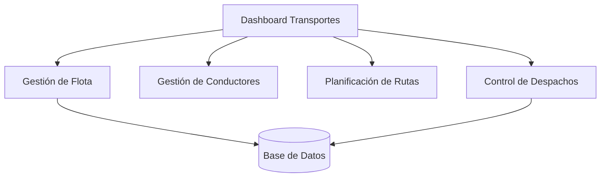
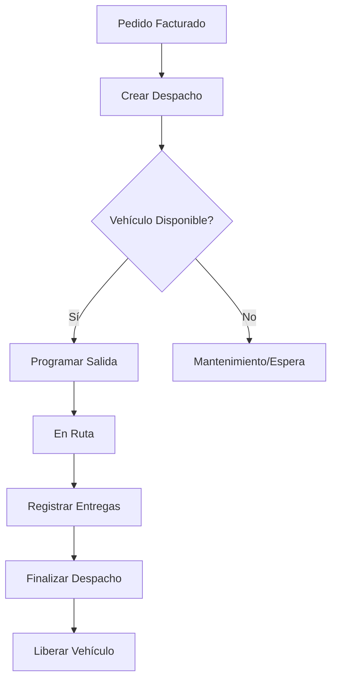

# Design Document - Submódulo de Transportes (Logística)

## Overview
Este módulo gestiona la logística de transporte de la empresa, incluyendo la flota de vehículos, conductores, rutas de entrega y la programación de despachos. Su objetivo es optimizar la distribución de productos terminados.

## Architecture Design
### System Architecture Diagram

## Component Design
### Vehículo & Mantenimiento
- **Responsabilidades**: Seguimiento de estado de la flota, alertas de vencimiento de documentos (SOAT, Revisión).
- **Dependencias**: Requiere el modelo TipoVehiculo.

### Despachos (Flujo Principal)
- **Responsabilidades**: Vincular una Ruta, un Vehículo y un Conductor para una salida programada.
- **Interfaces**: `DespachoForm`, `DespachoFinalizarForm`.

## Data Model
Se utilizan los modelos definidos en `apps/logistica/transportes/models.py`:
- `Vehiculo`: Maestro de flota.
- `Conductor`: Datos del personal de transporte.
- `Ruta` & `PuntoEntrega`: Definición geográfica de entregas.
- `Despacho`: Transacción central de viaje.

## Business Process

### Proceso de Despacho

## Error Handling Strategy
- Uso de `PROTECT` en llaves foráneas para evitar borrar vehículos con despachos históricos.
- Validación de odómetro (Llegada >= Salida).
- Control de permisos mediante `@permiso_requerido('TRANSPORTE', ...)`.